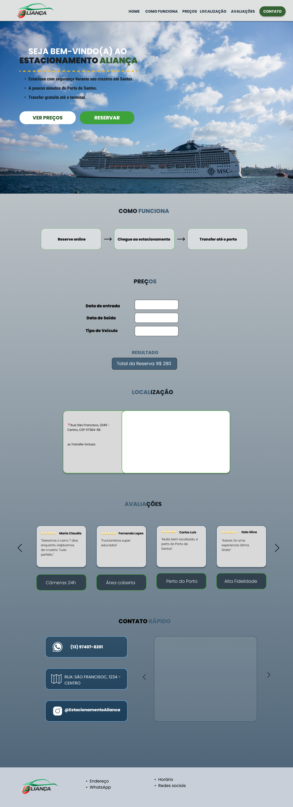

# Prototipagem do Sistema

A estrutura inicial das telas do sistema foi planejada com foco em simplicidade e facilidade de uso.

## Telas planejadas

- Página inicial
- Tela de como funciona o fluxo de reserva
- Tela de agendamento de vaga
- Tela de avaliações
- Tela de Contato

## Protótipo

Imagem do protótipo inicial do sistema:

Caso queira visualizar o protótipo completo:

Link: https://www.figma.com/design/vgLzZ2mDEeDpKl34lgpN0Q/Estacionamento_Alian%C3%A7a?node-id=0-1&t=LfNrzSPBGMl5jC1j-1